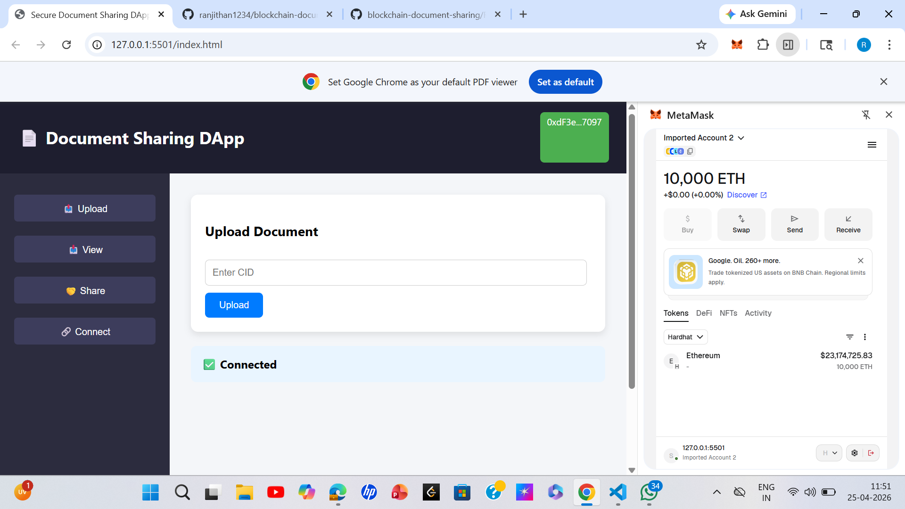
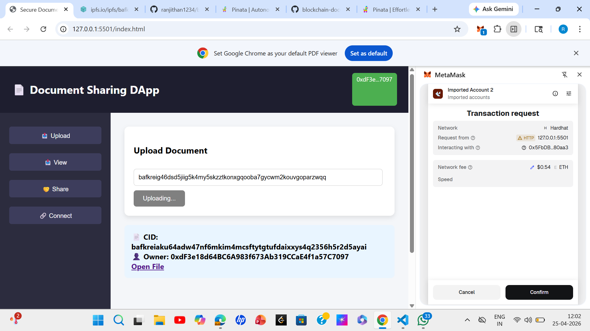
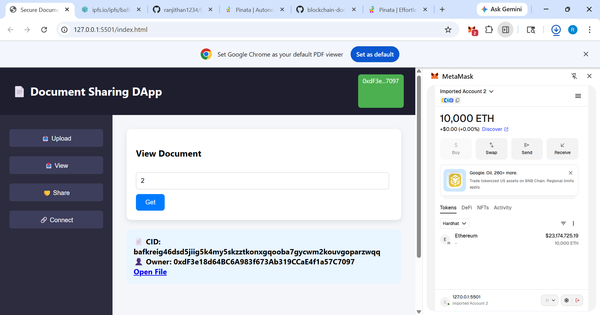
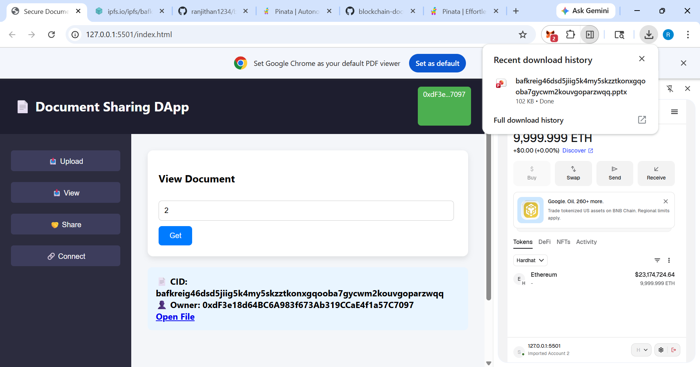

# 📄 Blockchain Document Sharing DApp

## 🔍 Project Overview
This project is a decentralized application (DApp) that allows users to upload, retrieve, and securely share documents using blockchain technology.

Documents are stored in IPFS and only the CID is stored on blockchain for security and efficiency.

---

## ⚙️ How It Works

1. User connects wallet using MetaMask  
2. Uploads document (CID from IPFS)  
3. CID is stored in smart contract  
4. User can retrieve document using ID  
5. Owner can share access with other users  

---

## 🛠️ Tech Stack

- Solidity (Smart Contract)
- Hardhat (Blockchain development)
- Ethers.js (Frontend interaction)
- MetaMask (Wallet)
- IPFS / Pinata (Storage)

---

## 📸 Output Screens

### 🔗 Wallet Connected


### 📤 Upload Document


### 📥 Retrieve Document


### 🤝 Share Document


### 📄 Open File


---

## ▶️ How to Run Project

```bash
npx hardhat node
npx hardhat run scripts/deploy.js --network localhost